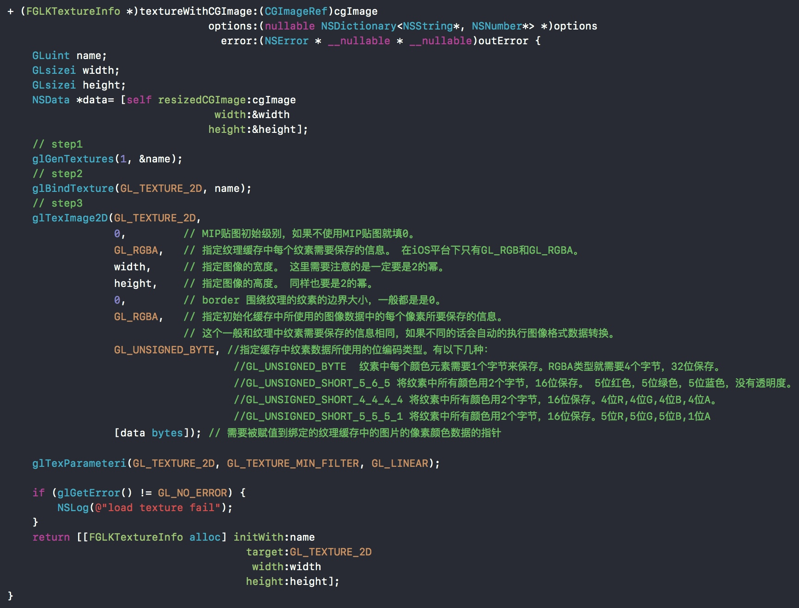
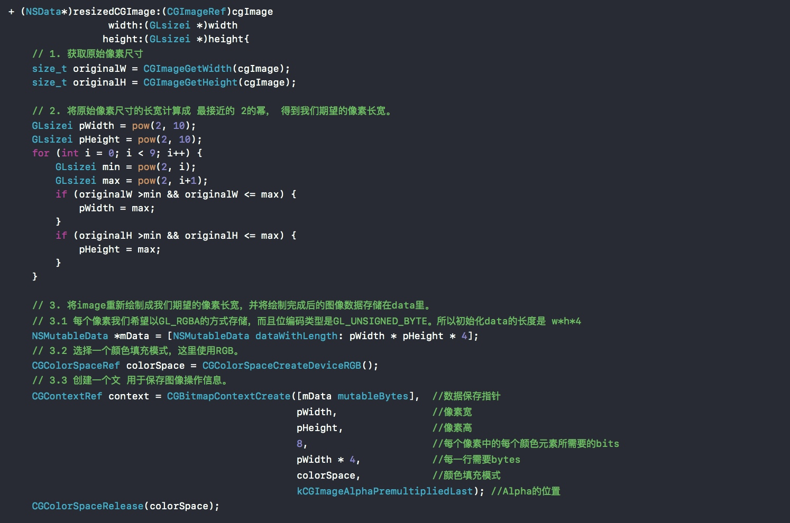

## GLTextureLoader && GLKTextureInfo 实现
- 纹理缓存的使用4步骤：纹理缓存和其他前面讨论的缓存具有相同的步骤。
	- `glGenTextures()`函数生成一个纹理标识符。
	- `glBindTexture()`函数将其绑定到当前上下文。
	- `glTeximage2D()`赋值图像数据来初始化纹理缓存内容。
	- `glDeleteTextures()`销毁。
	- 例如：

- 需要注意的是不管每个颜色元素保存的位数量是多少，颜色元素的强度最终会被GPU缩放到0~1之间。一个强度为满值的颜色元素（所有那个颜色的位都是1）则对应一个1.0强度。透明度颜色强度为1表示不透明，0表示透明。
- 大部分的OpenGL ES实现要么需要，要么受益于尺寸为2的幂的纹理。如果不是2的幂，纹理要么不工作，要么效率低下。这里我们使用了`resizedCGImage:width:height:` 方法一下图形的转换。 

